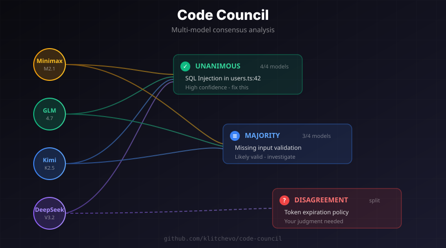

# Code Council

**One AI can miss things. A council of AIs catches more.**

[](https://www.npmjs.com/package/@klitchevo/code-council)
[](https://opensource.org/licenses/MIT)
[](https://github.com/klitchevo/code-council/actions)
[](https://codecov.io/gh/klitchevo/code-council)

Code Council runs your code through multiple AI models simultaneously, then shows you where they **agree**, where they **disagree**, and what **only one model caught**.


## Example Output

```
## Consensus Analysis

### Unanimous (All 4 models agree) - High Confidence

**Critical: SQL Injection Vulnerability**
Location: src/api/users.ts:42

The user input is directly interpolated into the SQL query without sanitization.
Use parameterized queries instead.

---

### Majority (3 of 4 models) - Moderate Confidence

**High: Missing Input Validation**
Location: src/api/users.ts:38

The userId parameter is used without validation. Add type checking.

---

### Disagreement - Your Judgment Needed

**Session Token Expiration**
Location: src/api/auth.ts:28

- Kimi K2.5: "Tokens should expire after 24 hours"
- DeepSeek V3.2: "Current 7-day expiration is reasonable for this use case"
- Minimax M2.1: "No issue found"

---

### Single Model Finding - Worth Checking

**Low: Magic Number**
Location: src/utils/pagination.ts:12
Found by: GLM 4.7

The value 20 should be extracted to a named constant.
```

## Why Multiple Models?

Different AI models have different strengths:

- **One model** might miss a security issue another catches
- **Unanimous findings** are almost certainly real problems
- **Disagreements** highlight where you should look closer
- **Single-model findings** might be noise, or might be the one model that saw something others missed

Think of it as getting 4 senior engineers to review your code at once.



## Quick Start

Add to your Claude Desktop config (`~/Library/Application Support/Claude/claude_desktop_config.json` on macOS):

```json
{
  "mcpServers": {
    "code-council": {
      "command": "npx",
      "args": ["-y", "@klitchevo/code-council"],
      "env": {
        "OPENROUTER_API_KEY": "your-api-key-here"
      }
    }
  }
}
```

Get your API key at [OpenRouter](https://openrouter.ai/keys).

That's it. Ask Claude: *"Use review_code to check this function: [paste code]"*

> **More setup options:** See [Configuration Guide](docs/configuration.md) for Cursor, VS Code, custom models, and advanced options.

## Use Cases

| Scenario | Tool | What You Get |
|----------|------|--------------|
| About to merge a PR | `review_git_changes` | Multi-model review of your diff |
| Planning a refactor | `review_plan` | Catch design issues before coding |
| Reviewing React components | `review_frontend` | Accessibility + performance + UX focus |
| Securing an API endpoint | `review_backend` | Security + architecture analysis |
| Want deeper discussion | `discuss_with_council` | Multi-turn conversation with context |
| Audit entire codebase | `tps_audit` | Flow, waste, bottlenecks analysis |

> **Full tool reference:** See [Tools Reference](docs/tools-reference.md) for all parameters and examples.

## Reading the Results

Code Council shows confidence levels for each finding:

| Level | Meaning | Action |
|-------|---------|--------|
| **Unanimous** | All models agree | High confidence - fix this |
| **Majority** | Most models agree | Likely valid - investigate |
| **Disagreement** | Models conflict | Your judgment needed |
| **Single** | One model found this | Worth checking |

## Configuration

Code Council works out of the box with sensible defaults. For customization:

- **[Configuration Guide](docs/configuration.md)** - MCP client setup, config files, environment variables
- **[Model Selection](docs/models.md)** - Choose models, pricing, performance tradeoffs
- **[Tools Reference](docs/tools-reference.md)** - Detailed tool parameters and examples

### Custom Models Example

```json
{
  "env": {
    "OPENROUTER_API_KEY": "your-api-key",
    "CODE_REVIEW_MODELS": ["anthropic/claude-sonnet-4.5", "openai/gpt-4o"]
  }
}
```

## Cost

Default models are chosen for cost-effectiveness (~$0.01-0.05 per review).

Swap in Claude/GPT-4 for higher quality at higher cost (~$0.10-0.30 per review).

See [Model Selection Guide](docs/models.md) for pricing details and optimization tips.

## Requirements

- Node.js >= 18.0.0
- [OpenRouter](https://openrouter.ai) API key
- MCP-compatible client (Claude Desktop, Cursor, etc.)

## Troubleshooting

**"OPENROUTER_API_KEY environment variable is required"**
Add the API key to the `env` section of your MCP client configuration.

**Reviews are slow**
This is expected when using multiple models. Consider using fewer models or faster models like Gemini Flash.

**Models returning errors**
Check your OpenRouter credits and model availability at [status.openrouter.ai](https://status.openrouter.ai).

## Contributing

Contributions welcome! Please open an issue or PR.

## License

MIT

## Links

- [OpenRouter](https://openrouter.ai) - Multi-model AI API
- [Model Context Protocol](https://modelcontextprotocol.io) - MCP specification
- [Claude Desktop](https://claude.ai/download) - MCP-compatible AI assistant
